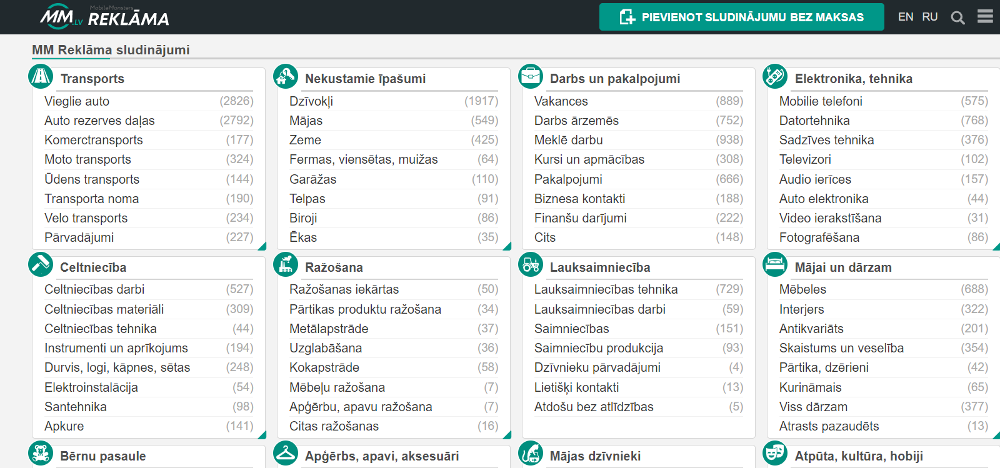
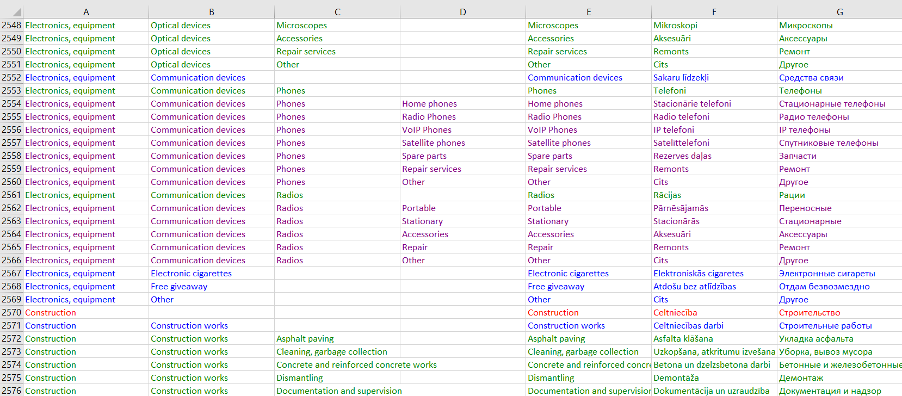

# MM.lv 
### Problem:
Looking for someone able to automatically collect datas from this website:

https://mm.lv/en
(website is in 3 languages)  
I need to collect the name of the categories / sub-categories / sub-sub-catégories / sub-sub-sub-categories.  
I need to have them in the 3 languages of the website.  
Datas can be recorded as follow (with the colors for me to distinguish the categories and subcategories)  
https://zupimages.net/up/20/16/ja3u.png  

The main difficult part, is that when you change the language of the website, the subcategories are changing place (it is certainly sorted by alphabetic position).  

This makes the translation not matching.  
### Solution:
- Get all the links of each category, sub category, 2x category, and so on based on 3 formats(ways to extract data):
    1. Through 'category' class (top level) (c/cc)
    2. Through 'title' and 'subcat' class (medium level) (cc/ccc/cccc)
    3. Through 'title' and 'active' class (lowest level) (ccc/cccc/ccccc)
- Then using Selenium, click the RU to change language to Russian then extract that translation
- Then click LV to change language to Latvian then extract that translation
- Store items in a array of dict to track its values, parent and link.
#### Algorithm:
##### Phase 1
- Get all the english category, sub category, 2x sub category, and 3x sub category based on the 3 formats
#### Phase 2
- Go to each link, then using Selenium, click RU extract the data still based on the 3 formats then click LV and extract the data also based on the 3 formats.

Note:
- Category(c) -> Sub Category(cc) -> 2x Sub Category(ccc) -> 3x Sub Category(cccc)
- Categories are distinguished by colors in .xlsx
    - c       - red
    - cc      - blue
    - ccc     - green
    - cccc    - purple
    - ccccc   - orange
- Data is a array of dict containing the following: en: , ru: , lv: , parent: , link:

# Screenshot of Website

# Output Data Specifications
|                      |    Amount   |
|----------------------|-------------|
| Category             | 12          |
| Sub Category         | 139         | 
| Sub Sub Category     | 1270        |   
| Sub Sub Sub Category | 2261        |   
| Total                | 3683        |  

Current Total 3683  
Original Total: 3765  
Estimated Accuracy: 3683/3675 = 97.82%

# Screenshot of Output Data

